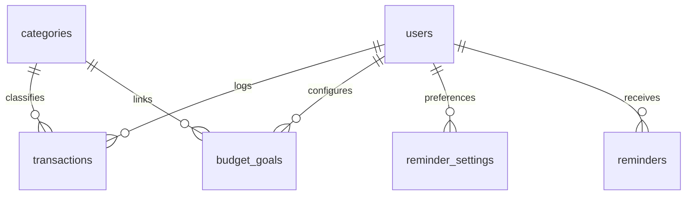

# 🚀 FinTrack PWA

**FinTrack PWA** is a smart, mobile-first Progressive Web App (PWA) and personal finance manager built on **Laravel 12** and **Filament PHP v3**. It allows users to track their daily transactions, configure category-based budgets, visualize savings targets, export PDF summaries, and receive personalized, Gen-Z themed AI reminders in Indonesian to stay on top of their financial health.

---

## 🌟 Key Features

### 📱 Progressive Web App (PWA)
- **Installable**: Adds directly to the home screen on iOS, Android, and desktop browsers with no store downloads required.
- **Offline Mode**: Native Service Worker caching allows browsing dashboard details and accessing core components even without an active internet connection.
- **Responsive Layout**: Designed specifically for a premium native app feel on mobile screens.

### 🤖 AI-Powered Reminders & Warnings
- **Gen-Z Tone**: Leverages the **OpenAI Chat API** (`gpt-4o-mini`) to generate witty, engaging, and friendly reminders in Indonesian (e.g., reminding users about budget goals so they don't have to enter "survival mode" or eat "mie prestige").
- **Dynamic Threshold Alerts**: Auto-calculates budget and goal milestones:
  - **Budget Warnings**: Triggers alerts when expense thresholds cross **50%**, **80%**, and **90%** of limits.
  - **Goal Milestones**: Celebrates savings milestones at **50%**, **80%**, **90%**, and **100% (Completed)** targets.
- **Daily Check-ins**: Sends scheduled reminders to log transactions in the morning (09:00 WIB) and evening (19:00 WIB).
- **Anti-Gagal Fallback**: Falls back automatically to rich static templates if the OpenAI API is offline or slow, ensuring notifications are never missed.

### 📊 Comprehensive Finance Management
- **Interactive Dashboard**: Features visual statistics and monthly breakdown widgets of income vs. expenses.
- **Budgets & Goals**: Configurable budget limits and savings goals mapped to specific categories.
- **Automatic Savings Observer**: An Eloquent observer (`TransactionObserver`) dynamically increments/decrements savings goal balances in real-time when transactions are created, updated, or deleted.
- **PDF Report Engine**: Download high-quality, professional summaries of Daily Transactions, Cashflows, and Budget Goals via `dompdf`.

---

## 🛠️ Tech Stack & Architecture

- **Backend**: [Laravel 12.x](https://laravel.com) (PHP 8.2+)
- **Admin Interface**: [Filament v3](https://filamentphp.com) (Fast, modern dashboard panel built on Livewire)
- **Styling & Assets**: [TailwindCSS](https://tailwindcss.com), [Vite](https://vite.dev)
- **PDF Engine**: [Laravel DomPDF](https://github.com/barryvdh/laravel-dompdf)
- **AI Service**: [OpenAI Chat Completion API](https://openai.com)
- **Scheduled Commands**: Laravel Console Command scheduler

---

## 📂 Project Architecture Outline

The core functionality of the FinTrack PWA is driven by the following files:

- **AI Services**:
  - `app/Services/NotificationAiService.php` - Prompt template builders, OpenAI HTTP connection handler, and fallback generator.
  - `app/Services/FintrackReminderNotificationService.php` - Formats contexts for users, transactions, and goals.
- **Artisan Console Commands**:
  - `app/Console/Commands/FintrackDailyTransactionRemindersCommand.php` - Queries active users, checks daily activity, and delivers morning/evening reminders.
  - `app/Console/Commands/FintrackBudgetGoalRemindersCommand.php` - Evaluates budgets and savings targets, compares progress thresholds, and logs progress.
- **Database Logic**:
  - `app/Models/BudgetGoal.php` - Savings goal and monthly spending limits.
  - `app/Models/Transaction.php` - Income and expense logs.
  - `app/Observers/TransactionObserver.php` - Synchronizes transactions and savings goals automatically.

---

## 💾 Database Schema Overview



1. **`users`**: Login credentials and general details.
2. **`categories`**: Mapped classifications for income and expenses.
3. **`transactions`**: Holds financial items specifying amount, date, description, and type (`income`/`expense`).
4. **`budget_goals`**: Tracks savings targets or monthly expenditure thresholds (`type: budget` or `type: goal`), keeping track of `target_amount` and `current_amount`.
5. **`reminder_settings`**: User-defined preferences regarding automated reminders.
6. **`reminders`**: Database log of delivered notifications visible in the Filament app.

---

## 🚀 Getting Started

### Prerequisites
Make sure you have installed:
- PHP 8.2 or newer
- Composer
- Node.js & NPM
- SQLite (default) or MySQL

### 1. Clone & Install Dependencies
```bash
git clone https://github.com/Nadhilatikahs/proter-fintrack.git
cd proter-fintrack
composer install
npm install
```

### 2. Configure Environment
Copy `.env.example` to `.env` and set up your application key:
```bash
cp .env.example .env
php artisan key:generate
```

In `.env`, configure your database connection and provide your OpenAI API key for AI-generated reminders:
```env
# Database configuration (SQLite by default)
DB_CONNECTION=sqlite

# OpenAI Configuration
OPENAI_API_KEY=your_openai_api_key_here
AI_MODEL=gpt-4o-mini
```

> [!NOTE]
> During local development, the AI notification client will automatically disable SSL verification to prevent common Windows curl certificate issues.

### 3. Run Database Migrations
Create your database and run migrations:
```bash
# For SQLite:
touch database/database.sqlite

# Run migrations
php artisan migrate --seed
```

### 4. Build Assets
Compile the TailwindCSS stylesheets and frontend bundle:
```bash
npm run build
```

### 5. Start Server
Run the local Laravel development server:
```bash
php artisan serve
```
Visit the application at: `http://localhost:8000`. Access the Filament dashboard panel at `http://localhost:8000/admin`.

---

## ⏰ Commands & Scheduler

FinTrack provides CLI commands to execute automated checks. These can be wired up in your OS Cron system or Laravel Scheduler:

### Daily Transaction Reminders
Triggers a notification to check if users have filled in their daily spendings.
- **Morning Reminder** (09:00 WIB):
  ```bash
  php artisan fintrack:daily-transaction-reminders pagi
  ```
- **Evening Reminder** (19:00 WIB):
  ```bash
  php artisan fintrack:daily-transaction-reminders malam
  ```

### Budget & Goal Alerts
Compares spent amounts against budgets and savings goals, flagging users on 50%, 80%, 90%, and 100% checkpoints:
```bash
php artisan fintrack:budget-goal-reminders
```

---

## 🔍 Testing & Verification

Run the test suite to verify the application functionality:
```bash
php artisan test
```

---

## 🛡️ License

The FinTrack application is open-sourced software licensed under the [MIT license](LICENSE).
